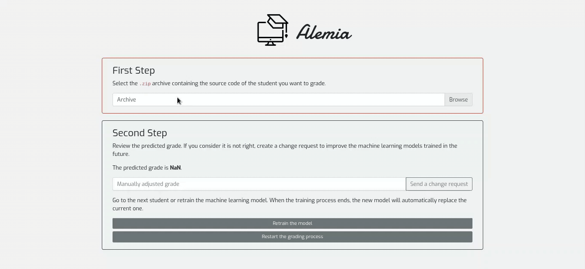

# Alemia

## Description

**Alemia** is a platform demonstrating the usage of **machine learning** techniques for **automatic grading of projects** build using object-oriented programming.

### Demo



## Setup

1. install [Python3](https://www.python.org/downloads/) and [Node.js](https://nodejs.org/en/download/)
2. set up and run the server

```
cd backend
pip3 install -r requirements.txt
python3 server.py
```

3. set up and run the user interface

```
cd user-interface
npm install
npm start
```

## Resources

### User Interface

- [React](https://reactjs.org/)
- [React Bootstrap](https://react-bootstrap.github.io/)
- [axios](https://github.com/axios/axios)
- logo from [Icons8](https://icons8.com/)

### Backend

- [Python3](https://www.python.org/)
- [Flask](https://flask.palletsprojects.com/en/1.1.x/)
- [Flask-CORS](https://flask-cors.readthedocs.io/en/latest/)
- [scikit-learn](https://scikit-learn.org/stable/index.html)
- [pandas](https://pandas.pydata.org/)
- [PyCryptodome](https://www.pycryptodome.org/en/latest/)
- [Cpplint](https://github.com/cpplint/cpplint)